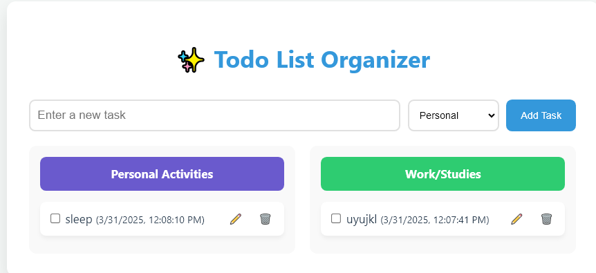

# 🚀 To-Do List Project

## Overview

Welcome to the **To-Do List Project**! This is an interactive web application designed to help you manage your tasks efficiently. Built with **HTML**, **CSS**, **JavaScript**, and **Node.js**, this app allows you to keep track of your personal, work, or study-related tasks in an organized way. 

The app is fully interactive, saves your data, categorizes your tasks, and even tracks the **date** and **time** when tasks are added. Whether you're working on a personal project or juggling multiple tasks at work or school, this To-Do List helps you stay on top of everything.

## 🌟 Features

- **Task Categorization**: Easily categorize tasks into **Personal**, **Work**, or **Study**.
- **Interactive Interface**: Add, view, and delete tasks with just a few clicks.
- **Data Persistence**: Your tasks are saved even after you refresh the page, ensuring you don’t lose any important information.
- **Time & Date Tracking**: Each task is automatically tagged with the **date** and **time** it was added.
- **Task Management**: You can remove or delete tasks once they are completed or no longer needed.

## 🔑 Importance of the To-Do List

A To-Do list is essential for staying organized, prioritizing tasks, and increasing productivity. By using this app, you can:

- **Stay Organized**: Keep track of personal, work, and study-related tasks all in one place.
- **Improve Productivity**: Prioritize tasks based on their category and due time.
- **Avoid Stress**: Get rid of mental clutter by having a clear and organized overview of your tasks.
- **Track Progress**: See when tasks were added and check off completed tasks.

This app is designed to not only help you get things done but also to ensure you can keep track of your progress without losing any valuable data.

## 🛠 Technologies Used

- **HTML**: For structuring the webpage and task list.
- **CSS**: For styling and creating a clean, responsive UI.
- **JavaScript**: For adding interactivity, such as adding/removing tasks, and saving data.
- **Node.js**: Used for backend functionality (e.g., saving data, managing requests).

## 🔗 Links

- **Live Demo**: [View the live demo here](https://rifuwo481.github.io/Todolist/)
- **GitHub Repository**: [Check out the code on GitHub](https://github.com/Rifuwo481/Todolist)

## 📸 Screenshots

Here’s a preview of how the app looks:

 

## 🚀 How to Run the Project Locally

### Prerequisites

1. Install **Node.js** on your computer.
2. Have a code editor like **VS Code**.

### Steps

1. Clone the repository:
   ```bash
   git clone https://github.com/Rifuwo481/Todolist.git
Navigate to the project directory:

bash
Copy
cd todo-list
Install the necessary dependencies (if any):

bash
Copy
npm install
Start the application:

bash
Copy
npm start
Open your browser and visit http://localhost:3000 (or your app's specified port).

📝 License
This project is licensed under the MIT License - see the LICENSE file for details.

🤝 Contributing
Feel free to contribute! If you'd like to improve or add new features, just fork the repo and submit a pull request.

Thank you for checking out the To-Do List Project! Stay productive and organized. 😊


